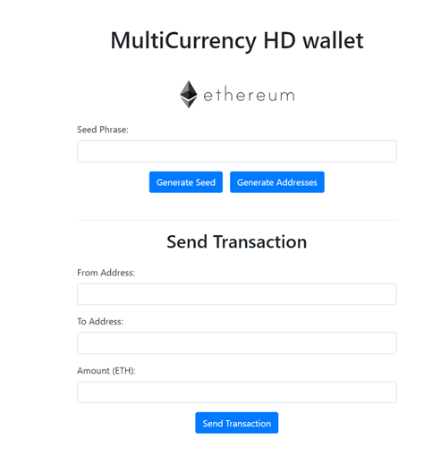
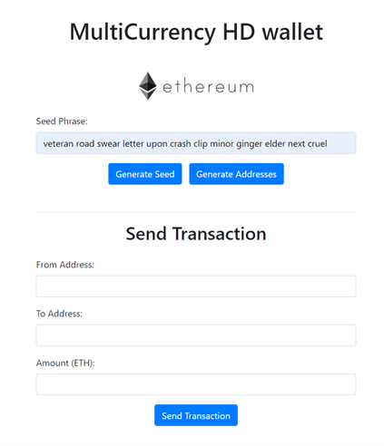
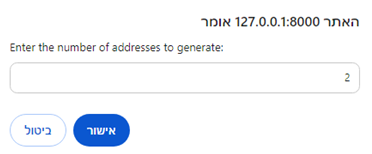
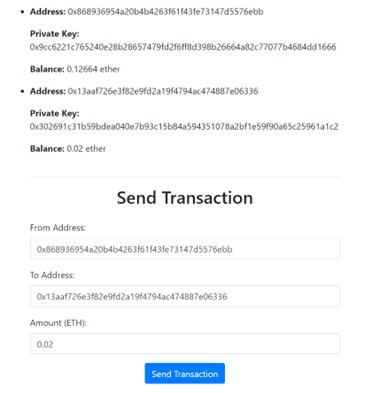
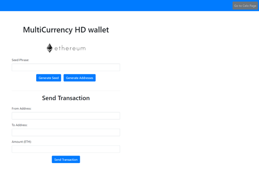
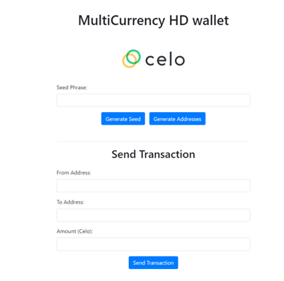

# MultiCurrency HD Wallet

## How to Run:
1. Open terminal and run the command:  
   `node ./app.js`
2. Open your browser and navigate to:  
   [http://127.0.0.1:8000/](http://127.0.0.1:8000/)

## Features:
MultiCurrency HD wallet supports two types of cryptocurrencies:
1. Ethereum
2. Celo

### Using the Wallet:
- **Generate Seed**: Click to generate a mnemonic phrase (seed).

- **Pre-generated Seed**: For demo purposes, use the following mnemonic:  
  `veteran road swear letter upon crash clip minor ginger elder next cruel`

- **Generate Addresses**: Enter your mnemonic phrase and click "Generate Addresses" to view addresses, private keys, and balances.

### Sending Transactions:
1. Enter the "From Address" and "To Address".
2. Specify the amount of Ethereum or Celo to send.
3. Click "Send Transaction" and view the transaction hash.

### Updating Balances:
Refresh the address balances by clicking "Generate Addresses" again after a transaction.

### Switching Currency:
Navigate to the Celo page using the top navigation bar. You can reuse the same mnemonic to generate Celo addresses and send transactions.

